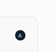

<div align="center">



<br />

# Awayra

### A calm, privacy-first break reminder for Windows

**Eye breaks. Movement reminders. Guided exercises. No account. No telemetry. No cloud dependency.**

[](https://github.com/AWAYRA/AWAYRA-WPF/releases/latest)
[](https://dotnet.microsoft.com/)
[](https://github.com/AWAYRA/AWAYRA-WPF/releases/latest)
[](LICENSE)
[](#privacy)

### [Download Awayra for Windows](https://github.com/AWAYRA/AWAYRA-WPF/releases/latest/download/Awayra-Setup-x64.exe)

[Latest release](https://github.com/AWAYRA/AWAYRA-WPF/releases/latest) · [Changelog](CHANGELOG.md) · [Report an issue](https://github.com/AWAYRA/AWAYRA-WPF/issues)

</div>

---

## Overview

Awayra is a free and open-source Windows application for people who spend long periods working at a computer.

It runs quietly in the background and reminds you to rest your eyes, look away from the screen, blink naturally, stand up, move, stretch, and avoid long uninterrupted periods of sitting.

Awayra is deliberately local-first. It does not require an account, does not depend on a cloud service, and does not send usage telemetry.

| Reminder | Default interval | Default duration | Purpose |
|---|---:|---:|---|
| **Eye Reset** | 20 minutes | 20 seconds | Distance focus, natural blinking and a short visual reset |
| **Move Break** | 45 minutes | 60 seconds | Stand, move, stretch and briefly leave the desk |

Both reminder engines are independent and can be configured separately.

---

# Product tour

The screenshots below show the current Awayra desktop interface and the controls users actually interact with.

## 1. System tray

<p align="center">
  
</p>

Awayra is built to live in the Windows notification area instead of occupying the taskbar all day.

**What the tray mode does:**

- keeps Eye Reset and Move Break timers active in the background
- lets the dashboard close without stopping reminder scheduling
- supports launch with Windows
- supports starting minimized
- supports closing the dashboard back to the tray
- keeps Awayra available until the user explicitly exits it

---

## 2. Main dashboard

<p align="center">
  
</p>

The dashboard is the operational overview of Awayra. It shows both reminder engines, today's activity and the controls needed during normal use.

### Eye Reset card

| Control | What it does |
|---|---|
| **Countdown** | Shows how long remains before the next Eye Reset |
| **Reminder** | Enables or disables scheduled Eye Reset reminders |
| **Sound** | Enables or disables the scheduled Eye Reset sound |
| **Eye Reset Now** | Starts an Eye Reset immediately without waiting for the timer |

### Move Break card

| Control | What it does |
|---|---|
| **Countdown** | Shows how long remains before the next Move Break |
| **Reminder** | Enables or disables scheduled Move Break reminders |
| **Sound** | Enables or disables the scheduled Move Break sound |
| **Move Break Now** | Starts a Move Break immediately without waiting for the timer |

### Today's statistics

Awayra records local daily counts for:

- completed Eye Resets
- completed Move Breaks
- skipped reminders
- snoozed reminders

### Dashboard actions

| Button | What it does |
|---|---|
| **Pause / Resume** | Temporarily pauses or resumes reminder scheduling |
| **Settings** | Opens the complete configuration window |
| **About & Support Awayra** | Opens project and support information |

---

## 3. Settings

<p align="center">
  
</p>

Settings is where Awayra's behavior is defined. The current window groups configuration into four practical areas: **Break sound and exercise**, **Reminder timers**, **Behavior and schedule**, and **Appearance and Windows**.

The reference below explains every visible setting in the screen.

### Break sound and exercise

Awayra includes six locally generated sound themes. No sound file needs to be downloaded at runtime.

| Setting | What it controls |
|---|---|
| **Soft bell** | Selects the short, gentle bell reminder |
| **Gentle chime** | Selects a light chime-style reminder |
| **Calm drop** | Selects a minimal soft tone |
| **Calm piano** | Selects a short calm piano phrase |
| **Morning dew** | Selects a gentle rising melody that fades in from silence |
| **Still water** | Selects a slower, deeper calm melody that fades in from silence |
| **Volume** | Sets reminder playback volume from 0% to 100% |
| **Repeat** | Sets the number of seconds between repeated sound playback while a break is active |
| **Preview sound** | Plays the selected sound immediately so it can be checked before saving |
| **Show the guided exercise animation** | Enables animated guidance during Eye Reset and Move Break |

When guided animation is disabled, the break can use a simpler countdown. **Reduced motion** keeps guidance available without the movement.

### Reminder timers

Eye Reset and Move Break have separate schedules. Changing one does not silently change the other.

#### Eye Reset

| Setting | What it controls |
|---|---|
| **Enable reminder** | Turns scheduled Eye Reset reminders on or off |
| **Play sound** | Controls whether scheduled Eye Resets play the selected break sound |
| **Interval** | Minutes between Eye Reset reminders. Standard configuration: **20 min** |
| **Duration** | Length of the Eye Reset overlay. Standard configuration: **20 sec** |

#### Move Break

| Setting | What it controls |
|---|---|
| **Enable reminder** | Turns scheduled Move Break reminders on or off |
| **Play sound** | Controls whether scheduled Move Breaks play the selected break sound |
| **Interval** | Minutes between Move Break reminders. Standard configuration: **45 min** |
| **Duration** | Length of the Move Break overlay. Standard configuration: **60 sec** |

The sound toggle inside a running fullscreen overlay affects only that active break. It does not rewrite the saved scheduled-sound preference.

### Behavior and schedule

#### Reminder actions

| Setting | What it controls |
|---|---|
| **Allow skip** | Shows or hides the Skip action on break overlays |
| **Allow snooze** | Shows or hides the Snooze action on break overlays |
| **Snooze** | Defines how many minutes a snoozed reminder is postponed. The shown configuration is **5 min** |
| **Reset after idle** | Treats genuine computer idle time as a break and resets reminder timing after the configured threshold |
| **Idle after** | Defines how long the computer must be idle before that reset applies. The shown configuration is **10 min** |

Idle reset prevents an unnecessary reminder from appearing immediately after you have already been away from the computer.

#### Work hours

| Setting | What it controls |
|---|---|
| **Enable work hours** | Restricts scheduled reminders to a defined daily time window |
| **Start** | Beginning of the active reminder window. The shown value is **09:00** |
| **End** | End of the active reminder window. The shown value is **18:00** |

When work hours are enabled, reminders outside the configured window wait until the active work period resumes.

### Appearance and Windows

#### Overlay appearance

| Setting | What it controls |
|---|---|
| **Overlay appearance slider** | Adjusts the visual strength of the fullscreen break overlay between the more solid and clearer presentation modes |
| **Reduced motion** | Keeps break guidance while suppressing animated movement |

A solid presentation can also be used when you do not want the temporary blurred-background capture described in the Privacy section.

#### Windows behavior

| Setting | What it controls |
|---|---|
| **Run at Windows startup** | Starts Awayra automatically when the user signs in to Windows |
| **Start minimized** | Starts Awayra without opening the dashboard as the foreground window |
| **Close dashboard to tray** | Closes the dashboard into the notification area instead of terminating Awayra |

### Save and Close

| Button | What it does |
|---|---|
| **Save** | Validates and persists the current settings |
| **Close** | Closes the Settings window |

---

## 4. Move Break

<p align="center">
  
</p>

Move Break interrupts long periods of continuous sitting with a focused fullscreen routine.

| Element | What it does |
|---|---|
| **Guided movement illustration** | Demonstrates the current movement or posture step when guided animation is enabled |
| **Current instruction** | Names the active movement step |
| **Large circular countdown** | Shows how many seconds remain in the break |
| **Supporting instruction** | Gives a short plain-language movement cue |
| **Sound on / off** | Mutes or restores sound for the currently running break only |
| **Skip** | Ends the current reminder as skipped when Skip is allowed in Settings |
| **Snooze** | Postpones the reminder by the configured snooze duration when Snooze is allowed |
| **Complete** | Marks the current Move Break as completed and closes the overlay |

The guided routine can encourage standing, walking briefly, resetting posture, moving the shoulders, stretching the upper body, or simply leaving the desk for a moment.

---

## 5. Eye Reset

<p align="center">
  
</p>

Eye Reset is a short interruption to prolonged close-up screen focus. The standard Awayra schedule uses a 20-second Eye Reset every 20 minutes.

| Element | What it does |
|---|---|
| **Eye guidance graphic** | Provides the visual focus point for the guided exercise |
| **Look far away** | Reminds the user to stop focusing at monitor distance |
| **Blink counter** | Tracks the guided blink sequence. The default exercise counts **10 blinks** |
| **Large circular countdown** | Shows the seconds remaining in the Eye Reset |
| **Distance-focus instruction** | Prompts the user to look at a distant object for a few breaths |
| **Relaxation instruction** | Reminds the user to blink naturally and relax the face |
| **Sound on / off** | Mutes or restores sound for the currently running Eye Reset only |
| **Skip** | Ends the reminder as skipped when Skip is enabled |
| **Snooze** | Postpones the reminder by the configured snooze duration when Snooze is enabled |
| **Complete** | Marks the Eye Reset as completed and closes the overlay |

Guided animation can be disabled, and Reduced Motion provides a quieter version of the same guidance.

---

# Core features

## Two independent reminder engines

Eye Reset and Move Break each maintain their own interval, duration, enabled state and sound preference. Use either reminder independently or run both together.

## Manual breaks

Both break types can be started directly from the dashboard. You do not need to wait for a scheduled timer.

## Daily statistics

Awayra stores local daily counts for completed Eye Resets, completed Move Breaks, skipped reminders and snoozed reminders.

## Idle-aware scheduling

Awayra can reset reminder timing after the computer has genuinely been idle for a configured period. This avoids firing a reminder immediately after the user has already taken a real break away from the device.

## Optional work hours

Scheduled reminders can be restricted to a defined daily window.

## Guided and reduced-motion experiences

Guided exercise animation can be enabled for a visual break routine, disabled for a plain countdown, or combined with Reduced Motion for static guidance.

## Windows desktop support

Awayra is designed for normal Windows desktop conditions including:

- Windows 10 and Windows 11
- multiple displays
- per-monitor DPI
- display configuration changes
- monitor sleep and wake
- Windows lock and unlock
- suspend and resume
- Windows startup
- system tray operation

---

# Privacy

Awayra is built to work locally.

It does **not** require:

- an account
- advertising
- telemetry
- analytics tracking
- a cloud profile
- browsing-history access
- application-usage tracking
- screenshot uploading

Settings, statistics and logs remain under:

```text
%LocalAppData%\Awayra\
```

## Break-overlay background capture

When a break uses the blurred/frosted background effect, Awayra can temporarily capture the display underneath the overlay so it can be blurred locally.

That image:

- exists only in memory
- is not written to disk
- is not uploaded
- does not leave the computer
- is discarded when the break closes

Use the solid overlay presentation if you do not want that temporary local capture used for the visual effect.

---

# Download and installation

| File | Purpose |
|---|---|
| [**Awayra-Setup-x64.exe**](https://github.com/AWAYRA/AWAYRA-WPF/releases/latest/download/Awayra-Setup-x64.exe) | Latest Windows x64 installer |
| [Awayra-Setup-x64.sha256.txt](https://github.com/AWAYRA/AWAYRA-WPF/releases/latest/download/Awayra-Setup-x64.sha256.txt) | SHA-256 checksum |
| [GitHub Releases](https://github.com/AWAYRA/AWAYRA-WPF/releases) | Release history and previous versions |

The installer includes the required .NET runtime and installs per-user under:

```text
%LocalAppData%\Programs\Awayra
```

Administrator privileges are not required for normal installation.

### Silent clean installation

```powershell
Awayra-Setup-x64.exe /VERYSILENT /CLEANDATA=yes
```

### Silent uninstall with local-data removal

```powershell
unins000.exe /VERYSILENT /CLEANDATA=yes
```

---

# Development

## Requirements

- Windows 10 or Windows 11 x64
- .NET 10 SDK
- PowerShell
- Inno Setup 7 for installer builds

## Run locally

```powershell
powershell -ExecutionPolicy Bypass -File .\scripts\dev.ps1
```

## Build and test

```powershell
powershell -ExecutionPolicy Bypass -File .\scripts\verify-change.ps1
```

## Build installer

```powershell
powershell -ExecutionPolicy Bypass -File .\scripts\build-installer.ps1
```

---

# Repository structure

| Path | Responsibility |
|---|---|
| `src/Awayra.Core` | Scheduling, settings, validation, statistics and domain logic |
| `src/Awayra.App` | WPF UI, tray integration, overlays, persistence, sounds, diagnostics and Windows integration |
| `tests/Awayra.Core.Tests` | Platform-neutral domain tests |
| `tests/Awayra.App.Tests` | WPF application and service tests |
| `tests/Awayra.UiTests` | Windows UI automation tests |
| `installer` | Inno Setup installer configuration |
| `scripts` | Local development, verification and release helper scripts |
| `docs/screenshots` | README product screenshots |

---

# Contributing and security

Before opening a pull request, read [CONTRIBUTING.md](CONTRIBUTING.md).

For security issues, follow [SECURITY.md](SECURITY.md) instead of opening a public vulnerability report.

- [CHANGELOG.md](CHANGELOG.md) — release history
- [SECURITY.md](SECURITY.md) — security policy
- [CONTRIBUTING.md](CONTRIBUTING.md) — contribution guidelines
- [TRADEMARKS.md](TRADEMARKS.md) — use of the Awayra name and branding

---

# License

Awayra is licensed under **GPL-3.0-only**.

See [LICENSE](LICENSE) for the complete license text.

Copyright © 2026 Farzin Alavi.

---

## Medical notice

Awayra is a wellness and break-reminder application. It is not a medical device and is not a substitute for professional medical advice, diagnosis or treatment.

Persistent eye pain, severe headaches, double vision, numbness or ongoing musculoskeletal pain should be evaluated by a qualified healthcare professional.